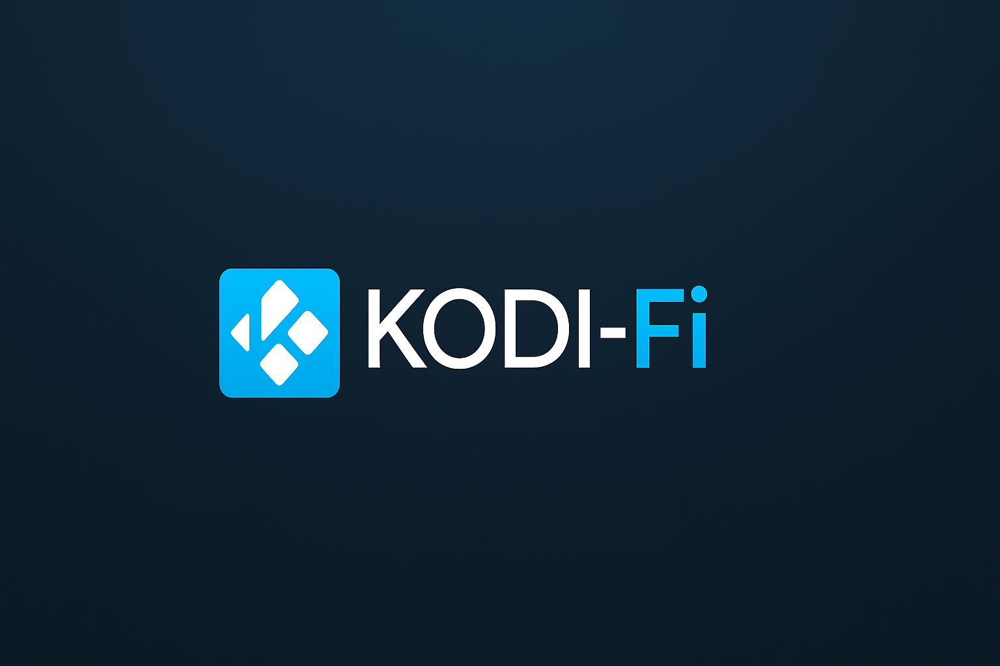

# 🎬 Kodi-Fi Repository

Welcome to **Kodi-Fi** — a fast, clean, Real-Debrid-ready Kodi build powered by the Arctic Horizon 2 skin and premium add-ons.

> 💡 Simple. Stylish. Supercharged for streaming.

---

## 🚀 Features

- 🧊 Beautiful **Arctic Horizon 2** interface  
- ⚡ Real-Debrid-ready out of the box  
- 🎞️ Popular add-ons preinstalled  
- 🔄 Auto-updating build system via **OpenWizard**  
- 🎯 Designed for performance and ease of use  

---

## 📥 How to Install

### 📦 Option 1: Add Kodi-Fi Repo

1. In Kodi, go to **Settings > File Manager > Add Source**
2. Add this URL:https://flash993.github.io/kodi-fi-repo3. Go to **Add-ons > Install from ZIP file**
4. Select `repository.kodifi-1.0.0.zip`
5. Install from repository → **Kodi-Fi Repo**
6. Install `Kodi-Fi Installer` and run it

---

### ⚙️ Option 2: Install the Build Directly

Use the preconfigured Kodi-Fi Build Installer:

👉 [Download Kodi-Fi Build Installer](https://flash993.github.io/kodi-fi-repo/plugin.program.kodifi.installer-1.0.0.zip)

---

## 🖼️ Preview

---

## 🧠 Why Use Kodi-Fi?

- No bloat — only what matters  
- Built for Kodi 20+  
- Updated regularly  
- Clean, intuitive menu layout  
- Stream-ready in under 5 minutes  

---

## ❓ Need Help?

If you have any issues:
- Open an [Issue](https://github.com/flash993/kodi-fi-repo/issues)
- Or ping me on GitHub

---

## 💡 Tip for Power Users

Want to host your own builds using OpenWizard and Google Drive?  
Ask about our build automation tools 🔧

---

> Kodi-Fi is independently created and not affiliated with Team Kodi. Use at your own discretion and follow all local streaming laws.

